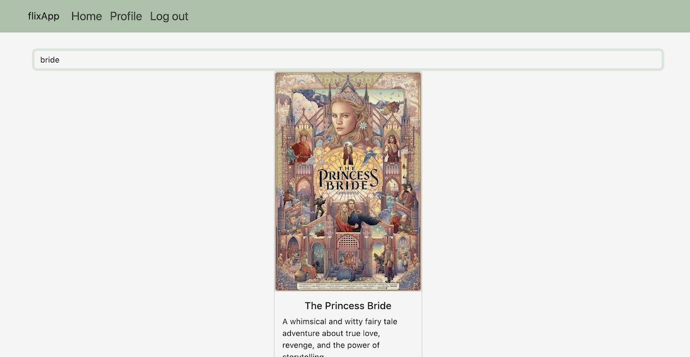
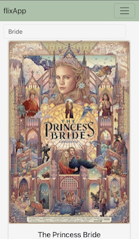

# mFlixApp (Client)

## Project Description

FlixApp is a movie review web application that allows users to browse, rate, and review their favorite movies. This repository contains the frontend client for FlixApp, built using React and React Bootstrap.

## Table of Contents

- [Features](#features)
- [Screenshots](#screenshots)
- [Live Demo](#live-demo)
- [Technologies Used](#technologies-used)
- [Getting Started](#getting-started)
  - [Prerequisites](#prerequisites)
  - [Installation](#installation)
- [Usage](#usage)
- [Contributing](#contributing)

## Features

- Browse a collection of movies with detailed information
- View movie details including title, description, genre, director, actors, and release year
- Add movies to your list of favorites
- User authentication and profile management
- Responsive design for optimal viewing on different devices

## Screenshots

#### Web View

| Home                                            |
| ----------------------------------------------- |
|  |

#### Mobile View

| Search                                      | Profile |
| ------------------------------------------- | ------- |
|  | !       |

## Technologies Used

- React
- React Bootstrap

## Getting Started

To get a local copy of the project up and running, follow the steps below.

### Prerequisites

- Node.js and npm installed on your system.

### Installation

1. Clone the repository to your local machine:

```
git clone https://github.com/your-username/flixapp-client.git
```

2. Navigate to the project directory:

```
cd flixapp-client
```

3. Install the dependencies:

```
npm install
```

## Usage

1. Start the development server:

```
npm start
```

2. Open your web browser and navigate to `http://localhost:3000` to access the FlixApp client.
